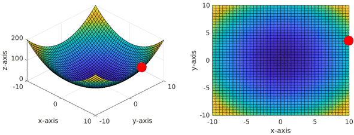

## Gradient descent example using a parabola function

The code is provided as implementation to visualise gradient descent optimisation in a parabola function space. 

Here is the output from this code, which is part of a series of blog posts at [adeeplearner.github.io](adeeplearner.github.io)

